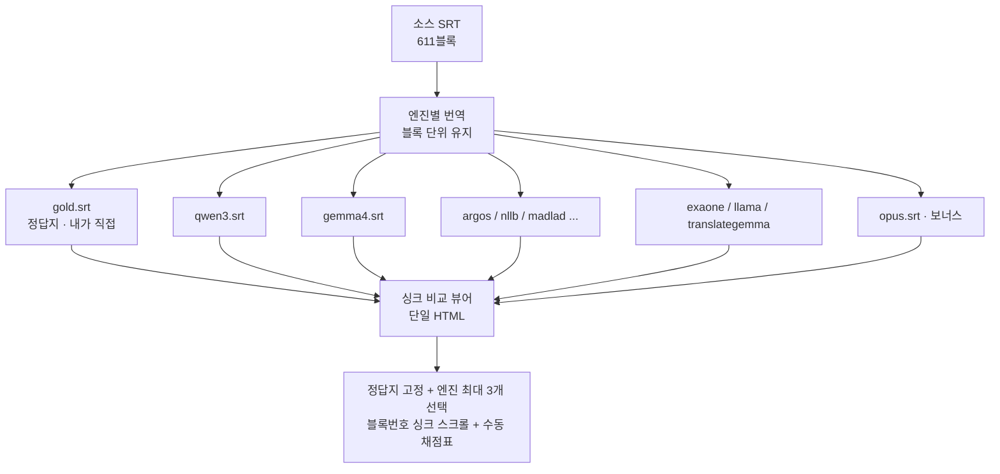

# 번역엔진 비교 테스트 진행플랜

> 참고: [`2026-08-30 083717 번역품질개선-모델비교.md`](../2026-08-30%20083717%20번역품질개선-모델비교.md)
> 작성: 2026-09-15 16:50

## 1. 목적

동일 문서(영어 연설 SRT)를 여러 번역엔진으로 각각 번역해, **접미사만 다른 파일**로 저장하고, **블록번호로 싱크되는 좌우 비교 뷰어**로 사람이 직접 품질을 확인한다. 자동 채점은 하지 않으며, 뷰어에 **수동 채점표**를 붙여 사용자가 눈으로 비교하며 점수를 매긴다.

- **소스**: `C:/Users/user/Documents/FunASR/caption_2026-09-10_09-26-10.srt` (611블록, 약 47분 Siemens DI Korea 타운홀 연설, 영어 위주 + 한국어·고유명사 다수)
- **정답지**: 내가 직접 1회 작성(Opus 4.8), 뷰어 맨 왼쪽 고정
- **정렬 방식**: SRT 블록 단위 유지(번호·타임스탬프 그대로, 텍스트만 한국어) → 블록번호로 자동 정렬

## 2. 비교 대상 엔진

문서 2-1(로컬 비-LLM) · 2-3(로컬 LLM) · 신규추가후보 3종 전부.

| 구분 | 엔진 | 문서 근거 | 현재 상태 | 필요 조치 | 무료 |
|---|---|---|---|---|---|
| 정답지 | **Gold (Opus 4.8, 내가 직접)** | — | ⏳ 작성 예정 | 없음 | ✅ |
| 2-3 로컬LLM | **qwen3:8b** | 2-3, 최종추천 | 🟢 번역 중 | 없음(설치됨) | ✅ |
| 2-3 로컬LLM | **gemma4** (Gemma 계열 대표) | 2-3 Gemma2 대체 | 🟡 대기(qwen3 다음) | 없음(설치됨) | ✅ |
| 2-1 로컬 | **argos-translate** (baseline) | 2-1 | ❌ 미설치 | `pip install argostranslate` + en→ko 패키지 | ✅ 오프라인 |
| 2-1 로컬 | **NLLB-200** (CTranslate2) | 2-1 | ❌ 미설치 | `ctranslate2` + 가중치 1.2~6.5GB | ✅ 설치 무거움 |
| 2-1 로컬 | **MADLAD-400** (CTranslate2) | 2-1 | ❌ 미설치 | 가중치 ~3GB + 변환 파이프라인 | ✅ 설치 무거움 |
| 2-3 로컬LLM | **EXAONE 3.5** | 2-3, 한국어 특화 | ❌ 미설치 | `ollama pull exaone3.5` (~4.8GB) | ✅ |
| 2-3 로컬LLM | **Llama3.1** | 2-3 | ❌ 미설치 | `ollama pull llama3.1` | ✅ |
| 2-3+신규 | **TranslateGemma** (번역특화) | 2-3, 신규① | ❌ 미설치·태그 미확인 | ollama 공식 태그 확인 or HF→GGUF 변환 | ✅ 태그 불확실 |
| 신규 | **OpenAI Translate** (전용통역) | 신규② | 🚫 불가 | **API 키 필요·유료** | ❌ |
| 신규 | **Gemini 3.5 Live Translate** | 신규③ | 🚫 불가 | **API/제품 연동, 범용 API 가용성 불명** | ❌ |
| (보너스) | **Claude Opus** (opencodex) | — | 🟢 번역 중 | 없음 | ✅ 무료 열 추가 |

> **제외 확정**: GPT-5.6·DeepSeek(opencodex 라우팅 불가). 문서 2-2의 DeepL·Google·Papago·GPT-4o-mini·Claude Haiku는 이번 비교 범위 밖(요청은 2-1·2-3·신규 3종).

### ⚠️ 우회 전 확인 필요 (설치·키)

아래는 **바로 진행하지 않고 사용자 확인 후** 처리한다.

1. **로컬 설치(무료지만 용량·시간)**: argos, NLLB-200(1.2~6.5GB), MADLAD-400(~3GB), EXAONE 3.5(~4.8GB), Llama3.1, TranslateGemma(태그 확인). → 설치 진행 여부·범위 확인 필요.
2. **API 키 필요(유료·가용성 불명)**: OpenAI Translate, Gemini 3.5 Live Translate. → 키 발급/제공 여부 확인 필요. 미제공 시 이 두 후보는 "미측정"으로 남긴다.

## 3. 파이프라인

### 파일 네이밍
`translations/caption_2026-09-10_09-26-10.<engine>.srt`
예: `.gold.srt`, `.qwen3.srt`, `.gemma4.srt`, `.argos.srt`, `.nllb.srt`, `.madlad.srt`, `.exaone.srt`, `.llama31.srt`, `.translategemma.srt`, `.opus.srt`

### 뷰어 사양
- 맨 왼쪽 **정답지 고정**, 그 오른쪽에 엔진 번역 **최대 3개 선택**(드롭다운).
- 블록번호 기준 **행 정렬 + 스크롤 싱크**(한 열 스크롤 시 전체 동기화).
- 각 행에 원문(영어) 토글 표시 옵션.
- **수동 채점표**: 엔진별 총점/메모 입력, 행 단위 플래그(오역·누락 체크). 자동 채점 없음. 입력값은 localStorage에 저장.

## 4. 실행 순서 (요청 반영)

1. **진행플랜 작성** — 본 문서. ✅
2. **로컬 2종 번역 완료** — qwen3:8b → gemma4 (배치 처리, 순차 실행 중).
3. **싱크 비교 뷰어 제작 + 실행** — 정답지 + qwen3 + gemma4로 우선 동작 확인. 수동 채점표 포함.
4. **설치·키 확인** — §2 ⚠️ 항목 사용자 확인.
5. **모든 후보 엔진 번역** — 확인된 엔진부터 각각 결과 문서 생성.
6. **전 엔진 로드 비교** — 뷰어에서 정답지 대비 최대 3종씩 비교·채점.

## 5. 현재 진행 상황 (2026-09-15 17:20)

- ✅ 정답지(gold) 작성 완료 — 611블록, `caption_….gold.srt`
- ✅ qwen3:8b 완료 — 611블록 (배치 처리, 20.9분)
- ✅ gemma4 완료 — 611블록
- ✅ Claude Opus(opencodex) 완료 — 611블록 (보너스 열)
- ✅ 싱크 비교 뷰어(`viewer.html`) 제작·문법 검증 완료, 브라우저로 오픈
- ❌ 나머지 엔진(argos·NLLB·MADLAD·EXAONE·Llama3.1·TranslateGemma / OpenAI·Gemini): **§2 ⚠️ 설치·키 확인 후 착수**

### 검증 로그
- 4개 파일 모두 611블록, 인덱스 1~611 연속 확인.
- 정답지 조립 시 누락 0 (`assemble_gold.py`).
- 뷰어 `engineOf()` 파일명 파싱·JS 문법 검사 통과.
