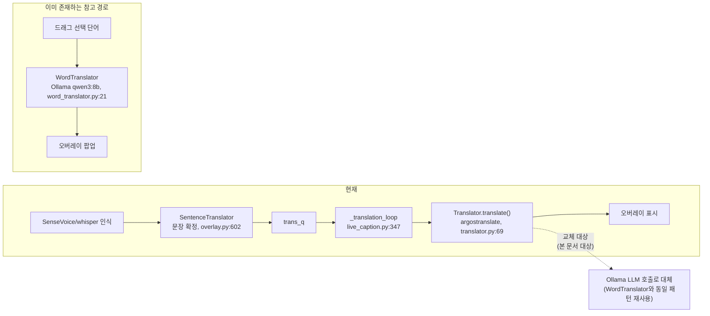
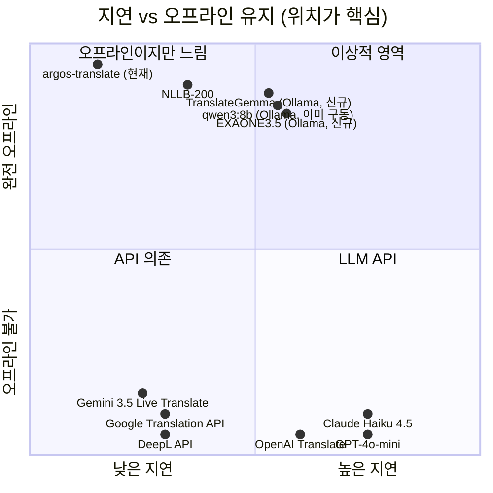

Python 실시간 자막 앱(`D:\pjt\liveCaption`) 문장 번역 품질 개선 — 모델/API 비교 및 추천

## 1. 배경 — 현재 구조 (코드 근거)

앱은 영어 음성을 SenseVoice(라이브)/faster-whisper(파일)로 인식해 자막을 띄우고, 문장 단위로 한글 번역을 오버레이에 병행 표시한다. 두 개의 서로 다른 번역 경로가 이미 존재한다.

- **문장 번역 (개선 대상)**: `live/translator.py`의 `Translator` 클래스가 `argostranslate`(오프라인 통계/NMT, en→ko)를 호출한다.
  - `translate()`는 준비 전/실패 시 `""`를 반환하고 **절대 예외를 던지지 않는다** (`live/translator.py:69-80`).
  - 백그라운드 스레드에서 미리 로딩하고(`live/translator.py:23-54`), 준비 안 됐으면 빈 문자열만 돌려준다(자막 파이프라인을 절대 막지 않는 설계 철학).
  - 호출 지점: `live/live_caption.py:347-357`의 `_translation_loop()` — 전용 스레드에서 `translator.translate(text)`를 호출하고 결과가 있으면 `bridge.new_translation.emit(ko)`.
  - 문장 확정 로직: `live/overlay.py:602`의 `SentenceTranslator`가 마침표로 끝난 완결 문장만 골라 `trans_q`에 넣는다(`live/overlay.py:606-664`, HOLD_MS=2000ms 디바운스).
- **단어/구 번역 (이미 LLM 사용 중, 참고 사례)**: `live/word_translator.py`의 `WordTranslator`가 자막 드래그 선택 시 로컬 Ollama를 호출한다.
  - `MODEL = "qwen3:8b"`, `URL = "http://localhost:11434/api/generate"` (`live/word_translator.py:17-18`).
  - 문장 맥락을 프롬프트에 함께 넣어 "이 문맥에서 이 단어의 뜻"을 물어봄(`live/word_translator.py:45-51`) — argos의 "문맥 없는 단어 번역" 약점(`"currencies" → "계좌번호"` 오역 사례, `live/word_translator.py:3-4` 주석)을 이미 이 방식으로 보완하고 있다.
  - 큐+워커 스레드로 비동기 처리, 콜드스타트 방지용 더미 요청(`live/word_translator.py:26-28`), 실패 시 `""` 반환·예외 없음(`live/word_translator.py:75-76`) — `translator.py`와 동일한 "절대 막지 않는다" 설계를 따른다.

즉 **이 머신엔 이미 Ollama 서버 + qwen3:8b 모델이 설치·구동 중**이며, 같은 방식(프롬프트+HTTP+콜드스타트 예열+예외 흡수)이 문장 번역에도 그대로 적용 가능한 상태다.

## 2. 후보 비교

세 축으로 나눠 이 앱의 실제 제약(영→한 실시간, 문장 단위, 지연 민감, 로컬 우선, Ollama 이미 구동 중)에 맞는 후보만 추렸다.

### 2-1. 로컬 (비-LLM 번역모델)

| 후보 | en→ko 품질 | 지연 | 비용/의존성 | 오프라인 | 비고(근거) |
|---|---|---|---|---|---|
| **argos-translate (현재, baseline)** | 낮음 — 문맥 없는 통계/소형 NMT, 어휘 선택 오역 잦음 | 낮음 (수십~수백ms, CPU) | 이미 설치됨, 추가 의존성 0 | O | en-de 기준 BLEU 34.9로 translateLocally(41.8)·OPUS-CAT(40.8)보다 낮음. "Argos has the same accuracy ceiling as NLLB"라는 평가도 있음(LibreTranslate 커뮤니티, note.com 비교글) |
| **NLLB-200 (CTranslate2 구동)** | 중간 — argos보다 개선되나 상용 API엔 못 미침 | 낮음~중간 (600M 증류판은 CPU도 가능, 3.3B는 GPU 권장) | 신규 의존성: `ctranslate2` + NLLB 가중치(600M~3.3B, 1.2GB~6.5GB) 설치 필요 | O | 슬로바키아어 비교 실험에서 "DeepL·Google이 NLLB-3.3B보다 유창성·충실도 모두 우위"(NLLB-200 fluency 3.40 vs DeepL 3.70). 512 토큰 제한으로 긴 문장 품질 저하 가능 (Hugging Face 문서) |
| **MADLAD-400 (3B/7B, CTranslate2)** | 중간~중간+ — 영어처럼 고자원 언어 짝에서는 상대적으로 나음 | 중간 (3B~10.7B, GPU 권장) | 신규 의존성: 모델 가중치(3B 기준 ~3GB) + 변환 파이프라인 설치 필요 | O | "고자원 언어(영어 포함) 짝에서 저자원 언어보다 우수", 특정 벤치마크(XCOMET)에서 GPT-4o를 능가한다는 보고 있으나 en-ko 전용 수치는 확인 안 됨(범용 400개 언어 지원이 강점이지 en-ko 특화 모델이 아님) |

**argos 대비 개선 폭**
- NLLB-200: 문맥·유창성 소폭 개선 예상되나 상용 API보다 낮고, 신규 대형 가중치·CTranslate2 스택 설치 비용 대비 이득이 크지 않음.
- MADLAD-400: 이론상 소폭 개선 가능하나 en-ko 전용 검증 데이터 부족, GPU 자원·설치 비용 대비 실익 불확실.
- 공통 한계: 이 계열 모두 "문장 하나만 넣고 통계적으로 최적 번역을 뽑는" NMT 구조라, argos가 갖는 근본 약점(문맥 없는 단어 선택, 구어체·도메인 특화 오역)을 완전히 해결하지 못한다.

### 2-2. API

| 후보 | en→ko 품질 | 지연 | 비용/의존성 | 오프라인 | 비고(근거) |
|---|---|---|---|---|---|
| **DeepL API** | 높음 — 톤·격식 처리가 로컬 모델보다 우수 | 낮음~중간 (전용 MT 엔진, 수백ms) | Growth 플랜: 월 50만자 무료, 초과분 $5/1M 입력 문자, 키 필요 | X | 2026년 API Pro 플랜 단종, Developer/Growth로 개편. "DeepL이 fluency 3.70·adequacy 3.73으로 NLLB류보다 우위" (langbly.com, eesel.ai 2026 가격 정리) |
| **Google Cloud Translation API** | 중상 — DeepL보다 약간 낮다는 평가가 일반적 | 낮음~중간 | $20/1M 문자(Basic/Advanced 동일), 월 50만자 무료, 키 필요. Adaptive Translation $25/1M, LLM 기반 TextTranslation $10+$10/1M | X | 2026년 기준 요금 확정 (chatscontrol.com, langbly.com). 신규 GCP 계정 $300 크레딧(90일 한정) |
| **Naver Papago (NCloud NMT)** | 한국어 자연스러움 강점(한국어 특화 학습) | 낮음~중간 | 100만 문자 단위 과금(정확한 단가는 공개 페이지 문의 필요), 키 필요 | X | "구·절 단위가 아닌 문맥 고려 번역"을 표방(NCloud 공식 소개). 단가는 검색으로 확정 못 함 — 실측 시 재확인 필요 |
| **OpenAI GPT-4o-mini** | 중상 — 구조화 출력·번역 특화 권장 모델 | 중간 (LLM 특성상 1~4초, 84 tok/s 벤치 사례) | $0.15/1M 입력, $0.60/1M 출력 토큰, 키 필요 | X | "OpenAI가 분류·추출·번역용으로 4o-mini를 공식 권장"(codeforgeek.com, gate.ai 2026). MT 전용 엔진보다 지연 큼(수백ms vs 1~4초) |
| **Anthropic Claude Haiku 4.5** | 중상 이상 — 플래그십 대비 격차가 작다는 평가 | 중간 (LLM 특성) | $1/1M 입력, $5/1M 출력, 키 필요 | X | "Haiku 4.5는 Gemini Flash-Lite·GPT-4o-mini보다 비싸지만 품질은 Sonnet에 가깝다"(2026 가격 비교 자료). 번역 전용 벤치마크 수치는 미확인 |
| **OpenAI Translate (전용 통역 모델)** ★신규 | 미확인 — 번역 전용으로 분리 출시 | 낮음~중간 (범용 LLM보다 전용 모델이 빠를 여지) | API 키·과금, 키 필요 | X | OpenAI가 Realtime·**Translate**·Whisper로 역할이 분리된 음성 모델 3종을 API로 출시. GPT-4o-mini 범용 LLM과 달리 번역 전용이라 지연·품질 실측 가치 있음(rawData: threads `unclejobs.ai` DYEJt8gCYG7, openai.com 발표) |
| **Google Gemini 3.5 Live Translate** ★신규 | 미확인 — 70+ 언어 실시간 통역 표방 | 낮음 (실시간 통역 목적 설계) | 제품/API 연동, 키 필요 | X | Google Meet·안드로이드 리스닝 모드로 70+ 언어 실시간 통역. 실시간 지향이라 지연 이점 가능하나 범용 API 제공 형태·en-ko 단가 미확인(rawData: threads `choi.openai` DZY0jDMD2gt) |

**argos 대비 개선 폭**
- DeepL: 가장 크게 개선될 후보(상용 MT 최상위권). 단, 인터넷 연결·API 키·비용 발생, 이 앱의 "오프라인 우선" 철학과 정면으로 배치.
- Google/Papago: DeepL과 유사한 트레이드오프, 품질은 DeepL 대비 동등~약간 아래로 보고됨.
- GPT-4o-mini/Claude Haiku: 문맥 인지 번역 가능(LLM이므로), 품질은 준수하나 API 키·과금·네트워크 지연(초 단위)이 실시간 자막 오버레이엔 부담. 완전 오프라인 불가.
- **OpenAI Translate / Gemini Live Translate (신규)**: 각각 "번역 전용 모델"·"실시간 통역"을 표방해 범용 LLM API보다 지연·품질에서 나을 여지가 있으나, 여전히 온라인·API 키 의존이라 오프라인 우선 철학과는 배치된다. 최고 품질 우선 시 DeepL과 함께 후보로 검토할 값어치는 있음.

### 2-3. 로컬 LLM (Ollama)

| 후보 | en→ko 품질 | 지연 | 비용/의존성(VRAM) | 오프라인 | 비고(근거) |
|---|---|---|---|---|---|
| **qwen3:8b (이미 설치·구동 중)** | 중상 — 문맥 인지 번역, `word_translator.py`에서 이미 검증된 실사용 사례 | 중간 — Q4 양자화 기준 40+ tok/s(6~8GB VRAM급 GPU), 문장 하나 번역은 통상 1초 내외 예상 | 신규 의존성 0 (이미 설치·구동, keep_alive로 상주 가능) | O | Qwen3는 Qwen2.5 대비 사전학습 토큰 2배(36T vs 18T), 119개 언어·방언 커버, 다국어 벤치마크에서 한국어 포함 경쟁력 있는 성능 보고(Qwen3 Technical Report, arXiv:2505.09388). "Qwen2.5-7B는 한국어 입력 강제 시 성능 10% 하락" 사례 있어 Qwen3가 개선판 성격 |
| **EXAONE 3.5 (LG, Ollama 지원)** | 잠재적으로 최고 — 한국어 특화 이중언어(en/ko) 학습 | qwen3:8b와 유사한 급(7.8B) | 신규 설치 필요(`ollama pull exaone3.5`), 별도 VRAM 점유(동시 구동 시 qwen3:8b와 자원 경합) | O | "LG AI Research가 한국어-영어 이중언어 데이터로 목적 구축, 로컬 한국어 LLM 중 최고"라는 평가(promptquorum.com 2026). Ollama 공식 라이브러리 등록됨(ollama.com/library/exaone3.5) |
| **Gemma2 / Llama3.1 (범용, Ollama)** | 중간 — 다국어 지원되나 한국어 특화도는 EXAONE·Qwen3 대비 낮다고 보고됨 | qwen3:8b와 유사 급 | 신규 설치 필요, VRAM 경합 | O | 검색으로 en-ko 전용 정량 비교 확보 못 함 — 범용 다국어 모델로 한국어 특화 모델 대비 우위 근거 부족 |
| **TranslateGemma (Gemma 기반 번역 특화, Ollama)** ★신규 | 잠재적 상위 — 범용 Gemma2가 아니라 **번역 목적 특화** 파인튜닝 | qwen3:8b급(모델 크기에 따라) | 신규 설치 필요(Gemma 계열 pull), VRAM 경합 | O | 로컬 번역·AI 팟캐스트 워크플로우에서 `translategemma`로 실사용 보고(rawData: github-stars `google-gemma/gemma-translator` ⭐1,236, threads `dev_restart` DYPn7K8E8dM). 범용 Gemma2와 달리 번역 특화라는 점이 차별점이나 en-ko 전용 정량 수치는 미확인 |

**argos 대비 개선 폭**
- qwen3:8b: **신규 설치·VRAM 추가 부담 0**으로 argos 대비 확실한 문맥 인지 개선(어순·관용구·구어체 오역 감소 기대). `word_translator.py`가 이미 같은 모델로 단어 단위에서 이 개선을 입증.
- EXAONE 3.5: 한국어 특화라 이론상 qwen3:8b보다 더 나을 가능성 있으나, 신규 모델 설치(수 GB 다운로드) + 동시 구동 시 VRAM 경합이라는 추가 비용 발생. "이미 있는 것 재사용" 원칙에는 어긋남.
- **TranslateGemma (신규)**: 범용 Gemma2와 달리 **번역 특화 파인튜닝**이라 en→ko 품질이 범용 로컬 LLM보다 나을 여지가 있고, 완전 오프라인(Gemma 계열)이라 앱 철학에 부합한다. 다만 EXAONE 3.5와 동일하게 신규 설치·VRAM 경합 비용이 있다. **번역 전용 로컬 모델이라는 점에서 qwen3:8b(범용 LLM)와 en-ko 품질 실측 비교 1순위 후보로 값어치가 있다.**
- Gemma2/Llama3.1: 특별한 강점 근거가 약해 EXAONE·Qwen3·TranslateGemma 대비 우선순위 낮음.

## 3. 요약 비교

## 3-1. 실측 — 엔진별 번역 소요 시간

동일 문서(`caption_2026-09-10_09-26-10.srt`, **611블록·약 47분 영어 연설**, en→ko)를 각 엔진으로 전량 번역한 실측치다. 정렬 보장을 위해 로컬 LLM은 **1블록=1요청(병렬 6워커)** 으로 처리했다.

| 엔진 | 실제 모델 태그 (`ollama show` / HF 조회) | 아키텍처 / 파라미터 / 양자화 | 방식 / 장치 | 소요 시간 | 비고 |
|---|---|---|---|---|---|
| **NLLB-200** | `facebook/nllb-200-distilled-600M` | NLLB / 600M / fp32 | transformers, GPU, batch16 | **0.9분** | 최속. 진짜 배치(텐서) 처리 |
| **argos-translate** | argos en→ko 패키지(내부 OpenNMT 소형) | 통계/소형 NMT | CPU, 블록단위 | **1.1분** | baseline, 직역체 |
| **TranslateGemma:4b** | `translategemma:4b` | **gemma3** / **4.3B** / Q4_K_M | Ollama, GPU, 블록단위×6 | **4.9분** | 번역특화. ⚠️ 최소 프롬프트(전/후 문맥 없음)로 측정 — 아래 프롬프트 사고 참고 |
| **gemma4** | `gemma4:latest` (= `gemma4:e4b`와 동일 스펙) | **gemma4** / **8.0B** / Q4_K_M | Ollama, GPU, 블록단위×6, 전/후 문맥 프롬프트 | **7.0분** | 문서 2-3의 "Gemma2/Llama3.1"이 아니라 로컬 4세대 Gemma. `e2b`(5.1B)도 별도 태그로 있으나 미사용 |
| **EXAONE 3.5** | `exaone3.5:latest` | exaone / **7.8B** / Q4_K_M | Ollama, GPU, 블록단위×6, 전/후 문맥 프롬프트 | **7.4분** | 한국어 특화 |
| **Llama3.1** | `llama3.1:latest` | llama / **8.0B** / Q4_K_M | Ollama, GPU, 블록단위×6, 전/후 문맥 프롬프트 | **7.7분** | |
| **MADLAD-400** | `google/madlad400-3b-mt` | T5 계열 / **3B** / fp16 | transformers, GPU, batch8 | **12.5분** | |
| **qwen3:8b** | `qwen3:8b` | qwen3 / **8.2B** / Q4_K_M | Ollama, GPU, 블록단위×6, 전/후 문맥 프롬프트 | **19.4분** | 문맥 프롬프트에서 장문 생성 경향 |
| **Claude Opus** | opencodex `ocx-claude-opus-4-8` (일괄 번역 서브에이전트) | `claude-opus-4-8` | 클라우드 서브에이전트 | **33.6분** | 네트워크 왕복 포함. 보너스 열 |
| **정답지(Gold)** | 없음(모델 아님) | 메인 에이전트(`claude-opus-4-8`)가 611블록 수기 번역 | 수기 번역 | — | Claude Opus로 만들었다는 점에서 opus 엔진 열과 모델 계열이 같음(방식만 다름) — 방식·이력은 앞선 대화 답변 참고 |

관찰:
- **로컬 소형 NMT(NLLB·argos)가 압도적으로 빠르다**(1분 내외). 품질 상한은 낮지만 속도·오프라인은 최고.
- **로컬 LLM(Ollama)은 5~19분대**. 같은 8B급이라도 생성 길이·양자화에 따라 편차(gemma4 7분 vs qwen3 19분).
- **TranslateGemma는 다른 Ollama LLM과 프롬프트 조건이 다르다** — 전/후 문맥을 프롬프트에 넣으면 그 문맥 텍스트를 지시가 아니라 입력으로 착각해 그대로 출력해 버려(186/611블록 오염) 최소 프롬프트로 재실행했다. 따라서 이 표의 TranslateGemma 시간은 "문맥 없음" 기준이라 gemma4·EXAONE·Llama3.1(문맥 있음)과 1:1 비교는 아니다.
- **클라우드 LLM(opus)은 33분**으로 가장 느리다 — 블록당 네트워크 왕복이 지배적.
- 측정 조건: 로컬은 단일 GPU 순차 실행(엔진 간 경합 없음), 배치 번호매김 방식은 정렬이 깨져 폐기하고 블록단위로 재측정.

> 참고 산출물: 엔진별 번역 결과 SRT는 `translations/caption_2026-09-10_09-26-10.<engine>.srt`, 비교 도구는 `viewer.html`(정답지 고정 + 엔진 최대 3개 싱크 비교 + 수동 채점표).

## 추천

**로컬 Ollama LLM(이미 설치된 `qwen3:8b`)로 문장 번역을 대체할 것을 추천한다.**

### 이유

1. **신규 의존성 0** — `pip install`도, 모델 다운로드도, API 키 발급도 필요 없다. `live/word_translator.py:17-18`에 정의된 동일 `MODEL`/`URL`을 `live/translator.py`의 `translate()` 내부에서 재사용하면 된다.
2. **이미 구동 중** — Ollama 서버가 상시 실행되고 있고, `word_translator.py`의 콜드스타트 예열 패턴(`live/word_translator.py:26-28`, `keep_alive: "10m"`)을 그대로 따르면 문장 번역 첫 호출도 느려지지 않는다.
3. **문맥 인지로 argos 대비 품질 향상** — argos는 문장 단위로 넣어도 통계/소형 NMT 특유의 어휘 선택 오역이 잦은 반면(`live/word_translator.py:3-4` 주석에 실제 오역 사례 기록), LLM은 프롬프트에 전체 문장 맥락을 담아 처리하므로 관용구·구어체·중의어 처리가 개선될 가능성이 높다. 이는 이미 단어 번역에서 같은 모델로 실증된 방식이다.
4. **오프라인 유지** — DeepL/Google/Papago/GPT/Claude는 전부 인터넷 연결과 API 키가 필요해 앱의 "로컬 우선" 설계 철학(자막 파이프라인을 절대 막지 않고, 외부 의존을 최소화)과 충돌한다. qwen3:8b는 완전 오프라인으로 이 철학을 유지한다.

### 트레이드오프 (공정하게 명시)

- **품질 상한선은 DeepL/GPT-4o/Claude가 더 높다.** 특히 DeepL은 "fluency·adequacy 모두 NLLB류보다 우위"라는 벤치마크가 있고, 상용 API는 학습 데이터·엔진 최적화 측면에서 로컬 8B급 LLM보다 유리할 수 있다. 최고 품질이 최우선 목표라면 DeepL API(월 50만자 무료 + $5/1M) 도입이 더 나은 선택일 수 있다.
- **EXAONE 3.5는 한국어 특화로 qwen3:8b보다 나을 가능성이 있다.** 다만 신규 모델 설치(수 GB)와 VRAM 경합(word_translator가 이미 qwen3:8b를 점유 중이므로 동시 구동 시 자원 다툼) 비용이 있어, "이미 있는 것 재사용"이라는 이 앱의 제약에서는 우선순위가 낮다.
- **TranslateGemma는 "오프라인 유지 + 번역 특화"를 동시에 만족하는 유일한 신규 후보다.** qwen3:8b가 범용 LLM인 반면 TranslateGemma는 번역 목적 파인튜닝이라, 오프라인 철학을 지키면서도 품질이 더 높을 여지가 있다. EXAONE 3.5와 같은 신규 설치·VRAM 경합 비용은 있으나, **품질을 한 단계 더 끌어올리고 싶을 때 API(DeepL) 도입 전에 먼저 로컬에서 시도해볼 1순위 벤치마크 대상**이다(en-ko 전용 수치 미확인이므로 실측 권장).
- **지연 측면에서 argos(수백ms, CPU)보다 qwen3:8b(LLM, 초 단위 가능성)가 느릴 수 있다.** 다만 `_translation_loop`가 이미 전용 스레드에서 비동기로 처리하고(`live/live_caption.py:347-360`) `trans_q`로 자막 파이프라인과 분리돼 있어, 번역이 늦어져도 자막 표시 자체는 막히지 않는 기존 설계가 이 지연을 흡수한다.
- 결론적으로 이 선택은 "유일한 정답"이 아니라, **이 앱의 제약(로컬 우선, 신규 의존성 최소화, Ollama가 이미 구동 중)** 아래에서 추가 비용 없이 가장 확실하게 argos 대비 품질을 끌어올릴 수 있는 현실적인 선택이다.

---

### 참고 자료(검색 근거)

- NLLB-200/CTranslate2: [entai2965/nllb-200-3.3B-ctranslate2](https://huggingface.co/entai2965/nllb-200-3.3B-ctranslate2), [LibreTranslate 커뮤니티 NLLB-200 스레드](https://community.libretranslate.com/t/nllb-200-with-ctranslate2/429)
- MADLAD-400: [arXiv:2309.04662](https://arxiv.org/abs/2309.04662), [picovoice.ai 오픈소스 번역 모델 비교(2026)](https://picovoice.ai/blog/open-source-translation/)
- argos-translate 품질: [LibreTranslate 커뮤니티 BLEU 스레드](https://community.libretranslate.com/t/bleu-scores-with-argos-translate/340), [note.com Argos/NLLB/Hy-MT2 비교](https://note.com/miccell/n/n1a65432f6818?hl=en), [NLLB.com 번역 정확도 리더보드](https://nllb.com/translation-accuracy-leaderboard/)
- DeepL API 가격: [eesel.ai DeepL 가격 정리(2026)](https://www.eesel.ai/blog/deepl-pricing), [langbly.com DeepL API 가이드](https://langbly.com/blog/deepl-api-pricing-guide/)
- Google Cloud Translation 가격: [chatscontrol.com Google Translation 가격(2026)](https://chatscontrol.com/blog/google-cloud-translation-api-pricing-limits-2026), [langbly.com Google Translation 비교](https://langbly.com/compare/google-cloud-translation-api-pricing/)
- Naver Papago NMT: [NCloud Papago Translation 공식 소개](https://www.ncloud.com/product/aiService/papagoTranslation), [Papago NMT API Reference](https://apidocs.ncloud.com/en/ai-naver/papago_nmt/)
- OpenAI GPT-4o-mini 가격/용도: [codeforgeek.com GPT-4o-mini 가격](https://codeforgeek.com/openai-gpt-4o-mini/), [gate.ai GPT-4o-mini 스펙(2026)](https://gate.ai/blog/gpt-4o-mini-specs-pricing-api-access-use-cases)
- Anthropic Claude Haiku 4.5 가격: [T-Minus AI Claude API 가격(2026)](https://www.tminusai.com/blog/claude-api-pricing-monthly-cost-2026)
- EXAONE 3.5: [LG-AI-EXAONE/EXAONE-3.5 GitHub](https://github.com/LG-AI-EXAONE/EXAONE-3.5), [Ollama exaone3.5 라이브러리](https://ollama.com/library/exaone3.5), [promptquorum.com 한국어 로컬 LLM 비교(2026)](https://www.promptquorum.com/prompt-bites/best-korean-language-models-local)
- Qwen2.5 vs Qwen3: [Qwen3 Technical Report(arXiv:2505.09388)](https://arxiv.org/pdf/2505.09388), [Qwen2.5 Technical Report(arXiv:2412.15115)](https://arxiv.org/pdf/2412.15115)
- qwen3:8b VRAM: [localllm.in Ollama VRAM 가이드(2026)](https://localllm.in/blog/ollama-vram-requirements-for-local-llms), [llmhardware.io Qwen3 하드웨어 요구사항](https://llmhardware.io/guides/qwen3-hardware-requirements)

### 신규 후보 추가 근거 (rawData 수집분, 2026-09-15 반영)

> `D:\pjt\liveCaption\.docs\rawData` 의 수집 요약에서 이 앱의 제약(영→한, 실시간, 로컬 우선)에 부합하는 **번역 특화** 후보만 추렸다. 나머지 수집 항목은 대부분 TTS/STT(이미 SenseVoice·FunASR·faster-whisper 사용 중)이거나 Claude Code 툴링이라 번역 모델 후보에서 제외했다.

- **TranslateGemma (번역 특화 로컬)** — `2026-07-11 160611 github-stars-summary.md` L125 `google-gemma/gemma-translator` (⭐1,236), `2026-07-11 162753 threads-reposts-summary.md` L350 `dev_restart` (translategemma 로컬 조합 워크플로우)
- **OpenAI Translate (전용 통역 모델)** — threads L348 `unclejobs.ai`, [OpenAI Advancing Voice Intelligence 발표](https://openai.com/index/advancing-voice-intelligence-with-new-models-in-the-api/)
- **Google Gemini 3.5 Live Translate** — threads L324 `choi.openai` (Google Meet·안드로이드 70+ 언어 실시간 통역)
